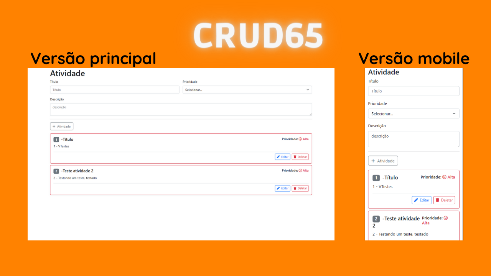
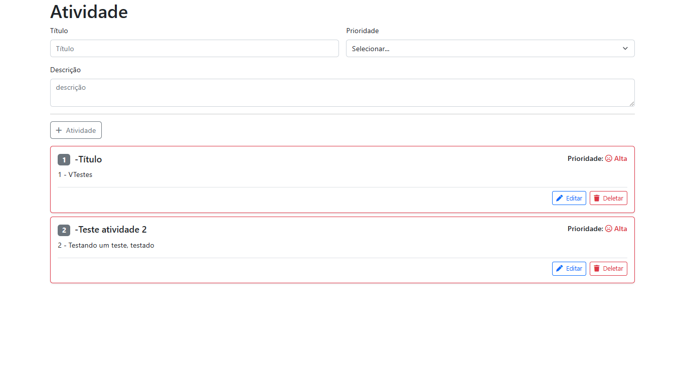

# CRUD-react-dotnetcore-efcore

Ainda em construção! criado como atividade de um curso de React-js + .NET-Core

Deploy: Nas próximas versões...

<h5>Front-end criado com React JS e Bootstrap5 já responsivo para diversos tamanhos de telas</h5>
<h4>Atualização Front-end: Organização de rotas:</h4>

Organização das rotas atráves do React-routes.

Criação dá página "clientes" e do seu filtro que é semelhante a uma barra de pesquisa.

Criação de rotas como "Page not found".

<h4>Front-end:</h4>

 
  
  

<h5>Rodar Front-end:</h5>
  
0 - Crie a (tela-de-comandos/prompt) na pasta "atividade-front-react" do front-end

  
1 - Instale as dependencias: npm install

  
2 - Rode projeto: npm start

<h4>Back-end</h4>

 
  
  

<h5>Rodar Back-end:</h5>
  
0 - Crie a (tela-de-comandos/prompt) na pasta "src" do back-end

  
1 - Instalação de dependencias: dotnet restore

  
2 - Crie o banco de dados: dotnet ef database update -s ProAtividade.API

  
3 - Rode projeto: dotnet watch run -p ProAtividade.API

